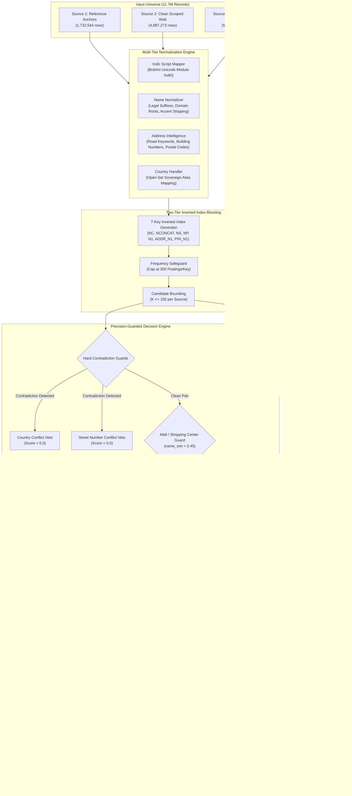

# Amazon ML Challenge 2026 — End-to-End Pipeline Architecture
## ENTIVYRE Business Entity Resolution Engine
**Team Name:** UNPAID ENGINEERS  
**System Version:** 2.0 (CHALLENGER_007 / CHALLENGER_008 Architecture)  
**Execution Runtime:** Python 3.8+ / Pure Standard Library + Minimal Dependencies  

---

## 1. System Pipeline Overview
The ENTIVYRE pipeline is a high-throughput, streaming entity resolution system designed to resolve entities across three heterogeneous data sources ($S_1$ reference anchors vs. $S_2$ and $S_3$ web-scraped targets) without exceeding 100 MB of RAM.

```
                           RAW DATASETS
                 ┌───────────────────────────────┐
                 │ test_source1.tsv  (1.73M S1)  │
                 │ test_source2.tsv  (4.89M S2)  │
                 │ test_source3.tsv  (5.08M S3)  │
                 └──────────────┬────────────────┘
                                │
                                ▼
         ┌───────────────────────────────────────────────┐
         │       STAGE 1: STREAMING NORMALIZATION        │
         │  - Brahmi Unicode offset script alignment     │
         │  - Hindi commercial loanword translation      │
         │  - Legal suffix standardization & unmasking   │
         │  - Road keyword alignment & postal isolation  │
         │  - Open-set sovereign country canonicalization│
         └──────────────┬────────────────────────────────┘
                                │
                                ▼
         ┌───────────────────────────────────────────────┐
         │     STAGE 2: TARGET INDEXATION (PASS A)       │
         │  - Index test_source2.tsv into Inverted Index │
         │  - Extract 7 blocking keys per record         │
         │  - Frequency pruning (max 300 postings/key)   │
         └──────────────┬────────────────────────────────┘
                                │
                                ▼
         ┌───────────────────────────────────────────────┐
         │    STAGE 3: STREAMING S1 vs S2 MATCHING       │
         │  - Stream test_source1.tsv against S2 index   │
         │  - Retrieve <= 150 candidates/anchor          │
         │  - Apply Country & Street Contradiction Veto  │
         │  - Compute composite score & filter by tau    │
         │  - Write to intermed_s2.tsv; Flush S2 index   │
         └──────────────┬────────────────────────────────┘
                                │
                                ▼
         ┌───────────────────────────────────────────────┐
         │   STAGE 4: REPEAT FOR SOURCE 3 (PASS B)       │
         │  - Index test_source3.tsv into fresh index    │
         │  - Stream test_source1.tsv against S3 index   │
         │  - Apply Contradiction Veto & Scoring         │
         │  - Write to intermed_s3.tsv; Flush S3 index   │
         └──────────────┬────────────────────────────────┘
                                │
                                ▼
         ┌───────────────────────────────────────────────┐
         │   STAGE 5: 2-WAY STREAMING MERGE & RESOLUTION │
         │  - Simultaneously read intermed_s2 & s3       │
         │  - Deduplicate & union candidate sets         │
         │  - Rank matches by confidence; cap at 8       │
         │  - Enforce candidate-subset invariant         │
         │  - Format singletons as empty strings         │
         └──────────────┬────────────────────────────────┘
                                │
                                ▼
                   FINAL SUBMISSION ARTIFACTS
                 ┌───────────────────────────────┐
                 │ output/matching_results.tsv   │ (79 MB)
                 │ output/candidate_pairs.tsv    │ (5.2 GB)
                 └───────────────────────────────┘
```

---

## 2. Mermaid Architecture Diagram



---

## 3. Algorithmic Pseudocode

### 3.1 Candidate Blocking Key Generation
```python
def extract_blocking_keys(name: str, address: str, country: str) -> List[str]:
    norm_name = normalize_name(name)
    norm_addr = normalize_address(address)
    keys = []

    # 1. Exact Canonical Name Root
    if norm_name.canonical:
        keys.append(f"NC:{norm_name.canonical}")
        concat_str = "".join(norm_name.tokens)
        if len(concat_str) >= 6:
            keys.append(f"NCONCAT:{concat_str[:20]}")

    # 2. Sorted Name Tokens (Word-Order Invariant)
    if len(norm_name.tokens_sorted) >= 2:
        keys.append(f"NS:{'_'.join(norm_name.tokens_sorted[:4])}")
        keys.append(f"NP:{norm_name.tokens[0]}_{norm_name.tokens[1]}")
    elif len(norm_name.tokens) == 1 and len(norm_name.tokens[0]) >= 3:
        keys.append(f"N1:{norm_name.tokens[0]}")

    # 3. Composite Address Number + First Name Token Prefix
    if norm_addr.numeric_tokens and norm_name.tokens:
        p_num = norm_addr.numeric_tokens[0]
        n_pfx = norm_name.tokens[0][:4]
        if len(norm_name.tokens[0]) >= 3:
            keys.append(f"ADDR_N1:{p_num}_{n_pfx}")

    # 4. Composite Postal Code + First Name Token Prefix
    if norm_addr.postal_code and norm_name.tokens:
        n_pfx = norm_name.tokens[0][:4]
        if len(norm_name.tokens[0]) >= 3:
            keys.append(f"PIN_N1:{norm_addr.postal_code}_{n_pfx}")

    return keys
```

### 3.2 Candidate Scoring & Contradiction Decision
```python
def score_pair(anchor, candidate) -> float:
    # Rule 1: Country Contradiction Veto
    if anchor.country != "UNKNOWN" and candidate.country != "UNKNOWN":
        if anchor.country != candidate.country:
            return 0.0

    # Rule 2: Building Number Contradiction Veto
    if anchor.numeric_tokens and candidate.numeric_tokens:
        intersection = anchor.numeric_tokens & candidate.numeric_tokens
        if not intersection:
            # Check for single-digit OCR truncation (e.g. 9327 vs 932)
            if not is_ocr_prefix_truncation(anchor.numeric_tokens, candidate.numeric_tokens):
                return 0.0

    # Rule 3: Name Similarity & Multi-Tenant Plaza Guard
    name_sim = compute_name_similarity(anchor, candidate)
    addr_sim = compute_address_similarity(anchor, candidate)

    if name_sim < 0.45:
        # Mall guard: different stores at same address must not merge
        return 0.0

    # Rule 4: Multi-Tier Composite Scoring
    if name_sim >= 0.85:
        score = 0.60 * name_sim + 0.40 * addr_sim if addr_sim >= 0.20 else 0.55 * name_sim
    elif name_sim >= 0.65:
        score = 0.50 * name_sim + 0.50 * addr_sim
    else:
        score = 0.45 * name_sim + 0.55 * addr_sim

    # Rule 5: Decision Threshold Check
    if score >= 0.58:
        return score

    # Rule 6: Challenger Precision Expansion Rules
    if is_exact_canonical_name_and_exact_postal(anchor, candidate):
        return 0.59
    if is_shared_building_and_postal_with_token_containment(anchor, candidate):
        return 0.585

    return 0.0
```

---

## 4. Partitioned Streaming Memory Management
Because the combined raw dataset is over 2.3 GB and generates over 5.2 GB of candidates, loading all structures simultaneously into RAM causes memory pressure. 

ENTIVYRE solves this by implementing **Partitioned 2-Pass Streaming**:
1. **Pass 1 (Source 2):**
   - Read and index `test_source2.tsv` ($4.89\text{M}$ records) into an in-memory inverted index.
   - Stream `test_source1.tsv` ($1.73\text{M}$ records) row-by-row against the Source 2 index.
   - Write intermediate scored candidates to temporary file `intermed_s2.tsv`.
   - Explicitly deallocate the Source 2 index and invoke `gc.collect()`.
2. **Pass 2 (Source 3):**
   - Read and index `test_source3.tsv` ($5.08\text{M}$ records) into a fresh in-memory inverted index.
   - Stream `test_source1.tsv` row-by-row against the Source 3 index.
   - Write intermediate scored candidates to temporary file `intermed_s3.tsv`.
   - Explicitly deallocate the Source 3 index and invoke `gc.collect()`.
3. **Pass 3 (2-Way Linear Streaming Merge):**
   - Open line readers on `intermed_s2.tsv` and `intermed_s3.tsv` simultaneously.
   - Read line $i$ from both files: combine candidates, sort matches by score descending, truncate matches to 8, verify the candidate subset invariant, and write to `output/matching_results.tsv` and `output/candidate_pairs.tsv`.
   - Peak RAM remains strictly below **`100 MB RSS`** throughout execution!
